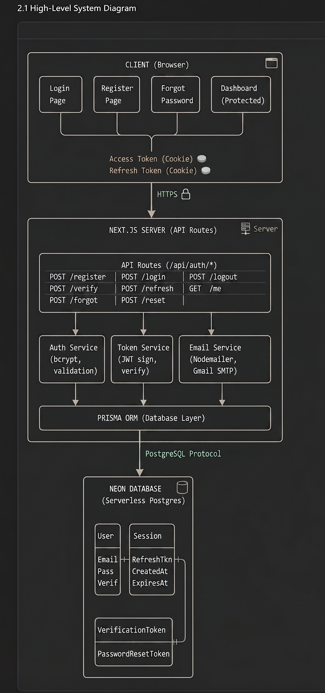
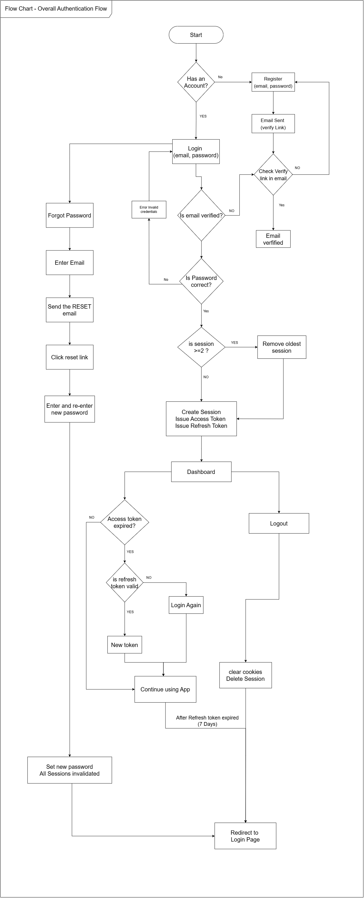
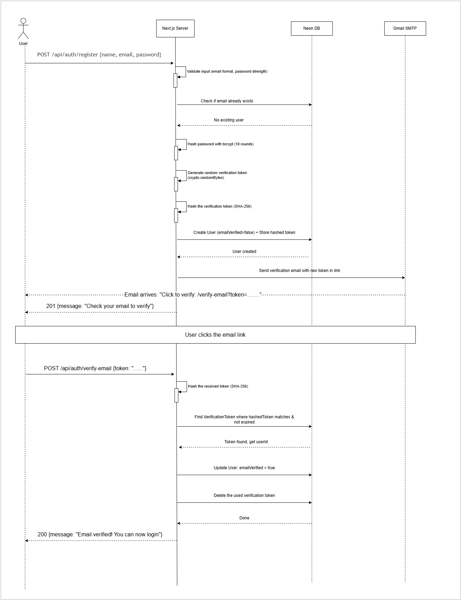

# Login Project - Secure Authentication System

A production-grade, full-stack authentication system built with **Next.js**, **TypeScript**, **Prisma ORM**, and **Neon DB**. Features secure user registration, email verification, JWT-based session management, and password reset functionality.

 **Live Demo:** [https://login-project-bice.vercel.app](https://login-project-bice.vercel.app)

 **Postman Collection:** [View API Collection](https://vidurachandrasekara.postman.co/workspace/Vidura-Chandrasekara's-Workspac~98dd7a22-0473-41c9-8a3f-d6be24814006/collection/45889047-8400c3e5-f0aa-4f92-bf8c-e0143e454c2e?action=share&creator=45889047)

---

##  Table of Contents

- [Features](#-features)
- [Tech Stack](#-tech-stack)
- [System Architecture](#-system-architecture)
- [Authentication Flow](#-authentication-flow)
- [API Endpoints](#-api-endpoints)
- [Database Schema](#-database-schema)
- [Security Measures](#-security-measures)
- [Getting Started](#-getting-started)
- [Environment Variables](#-environment-variables)
- [Deployment](#-deployment)
- [Diagrams](#-diagrams)

---

##  Features

- **User Registration** with input validation and duplicate email detection
- **Email Verification** via tokenized verification links
- **Login/Logout** with secure session creation and cleanup
- **Access + Refresh Token** pattern for optimal security
- **2-Session Limit** per user (oldest session removed automatically)
- **Token Rotation** on every refresh for enhanced security
- **Forgot/Reset Password** flow with email-based recovery
- **Protected Routes** using JWT middleware
- **Responsive UI** with blue/white Tailwind CSS theme

---

##  Tech Stack

| Layer | Technology |
|-------|-----------|
| **Framework** | Next.js 16 (App Router) |
| **Language** | TypeScript |
| **ORM** | Prisma 7 |
| **Database** | Neon (Serverless PostgreSQL) |
| **Authentication** | JWT (Access Token) + Random String (Refresh Token) |
| **Password Hashing** | bcrypt (10 salt rounds) |
| **Token Hashing** | SHA-256 |
| **Email Service** | Nodemailer (Gmail SMTP) |
| **Styling** | Tailwind CSS v3 |
| **Deployment** | Vercel |

---

##  System Architecture



The system follows a **layered architecture**:

1. **Client Layer** - Next.js frontend pages (Login, Register, Dashboard, etc.)
2. **API Layer** - Next.js API Routes handling authentication logic
3. **Service Layer** - Core utilities (JWT, Tokens, Email, Validation)
4. **Data Layer** - Prisma ORM communicating with Neon PostgreSQL

---

##  Authentication Flow



### Token Strategy

| Token | Type | Lifetime | Storage | Purpose |
|-------|------|----------|---------|---------|
| **Access Token** | JWT | 15 minutes | HTTP-only Cookie | Authenticate API requests |
| **Refresh Token** | Random String | 7 days | HTTP-only Cookie + DB (hashed) | Issue new access tokens |

### How It Works

1. **Register** → User signs up → Verification email sent → User verifies email
2. **Login** → Credentials validated → Access + Refresh tokens issued as HTTP-only cookies
3. **API Requests** → Access token verified on each request
4. **Token Expired** → Client calls `/api/auth/refresh` → New tokens issued (rotation)
5. **Logout** → Session deleted from DB → Cookies cleared
6. **Password Reset** → Reset email sent → Token validated → Password updated → All sessions invalidated

---

##  API Endpoints

### Registration & Verification

| Method | Endpoint | Description |
|--------|----------|-------------|
| `POST` | `/api/auth/register` | Create a new user account |
| `POST` | `/api/auth/verify-email` | Verify email with token |

### Authentication

| Method | Endpoint | Description |
|--------|----------|-------------|
| `POST` | `/api/auth/login` | Login and create session |
| `POST` | `/api/auth/logout` | Logout and destroy session |
| `POST` | `/api/auth/refresh` | Refresh access token |
| `GET` | `/api/auth/me` | Get current authenticated user |

### Password Recovery

| Method | Endpoint | Description |
|--------|----------|-------------|
| `POST` | `/api/auth/forgot-password` | Send password reset email |
| `POST` | `/api/auth/reset-password` | Reset password with token |

### Sequence Diagram - Registration & Email Verification



---

##  Database Schema

The system uses 4 database models:

```
User
├── id          (String, CUID)
├── name        (String)
├── email       (String, unique)
├── password    (String, bcrypt hash)
├── emailVerified (Boolean)
├── createdAt   (DateTime)
└── updatedAt   (DateTime)

Session
├── id           (String, CUID)
├── userId       (String, FK → User)
├── refreshToken (String, SHA-256 hash)
├── userAgent    (String)
├── ipAddress    (String)
├── expiresAt    (DateTime)
└── createdAt    (DateTime)

VerificationToken
├── id        (String, CUID)
├── userId    (String, FK → User)
├── token     (String, SHA-256 hash)
└── expiresAt (DateTime, 24 hours)

PasswordResetToken
├── id        (String, CUID)
├── userId    (String, FK → User)
├── token     (String, SHA-256 hash)
└── expiresAt (DateTime, 1 hour)
```

---

##  Security Measures

| Measure | Implementation |
|---------|---------------|
| **Password Storage** | bcrypt hashing with 10 salt rounds |
| **Token Storage** | SHA-256 hashed before storing in database |
| **Cookie Security** | HTTP-only, Secure, SameSite=Lax flags |
| **XSS Protection** | HTTP-only cookies prevent JavaScript access |
| **CSRF Protection** | SameSite cookie attribute |
| **Email Enumeration** | Forgot password returns same response regardless of email existence |
| **Session Limiting** | Maximum 2 concurrent sessions per user |
| **Token Rotation** | New refresh token issued on every refresh |
| **Password Reset** | All sessions invalidated after password change |
| **Input Validation** | Email format, password strength, name length validation |

---

##  Getting Started

### Prerequisites

- Node.js v20+
- npm
- Neon DB account
- Gmail account with App Password

### Installation

```bash
# Clone the repository
git clone https://github.com/ViduraMC/Login-Project.git
cd Login-Project

# Install dependencies
npm install

# Generate Prisma client
npx prisma generate

# Run database migrations
npx prisma migrate dev

# Start the development server
npm run dev
```

The app will be running at `http://localhost:3000`.

---

##  Environment Variables

Create a `.env` file in the root directory:

```env
# Database
DATABASE_URL="your-neon-database-connection-string"

# JWT Secrets (generate with: node -e "console.log(require('crypto').randomBytes(64).toString('hex'))")
ACCESS_TOKEN_SECRET="your-64-byte-hex-string"
REFRESH_TOKEN_SECRET="your-64-byte-hex-string"

# Email (Gmail SMTP)
EMAIL_USER="your-email@gmail.com"
EMAIL_APP_PASSWORD="your-gmail-app-password"

# App URL
NEXT_PUBLIC_APP_URL="http://localhost:3000"
```

---

##  Deployment

This project is deployed on **Vercel** with automatic deployments from the `main` branch.

### Git Workflow

```
main (production) ← development (integration) ← feature/* (working branches)
```

### Branches Used

| Branch | Purpose |
|--------|---------|
| `main` | Production deployment |
| `development` | Integration and testing |
| `feature/prisma-schema` | Database schema setup |
| `feature/core-libs` | Core utility functions |
| `feature/auth-register` | Registration & email verification |
| `feature/auth-login` | Login, logout, token refresh |
| `feature/auth-password-reset` | Forgot/reset password & protected routes |
| `feature/ui` | Frontend pages |


---

##  Author

**Vidura Malinda Chandrasekara**

- GitHub: [@ViduraMC](https://github.com/ViduraMC)
